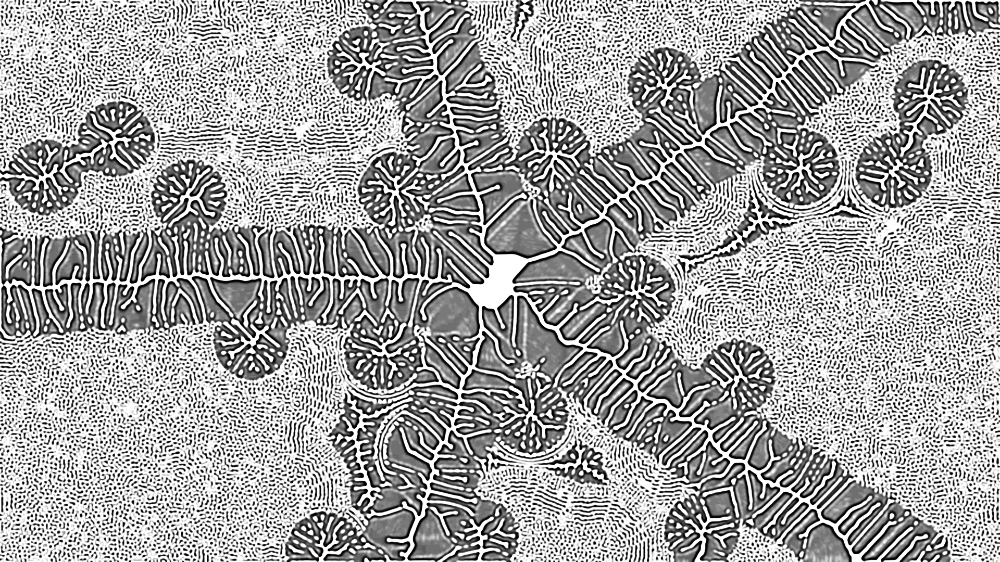

# ReacDiff

Génération de motifs d'après l'algorithme de réaction-diffusion de Grey-Scott. 
Programme écrit avec Processing et la librairie ControlP5 pour l'UI. Shaders GLSL pour le calcul de l'algorithme de réaction-diffusion. 
Réalisé dans le cadre de la résidence "Se défiler du travail" à la Baleine, pendans la semaine du 26 au 30 Avril 2021.
